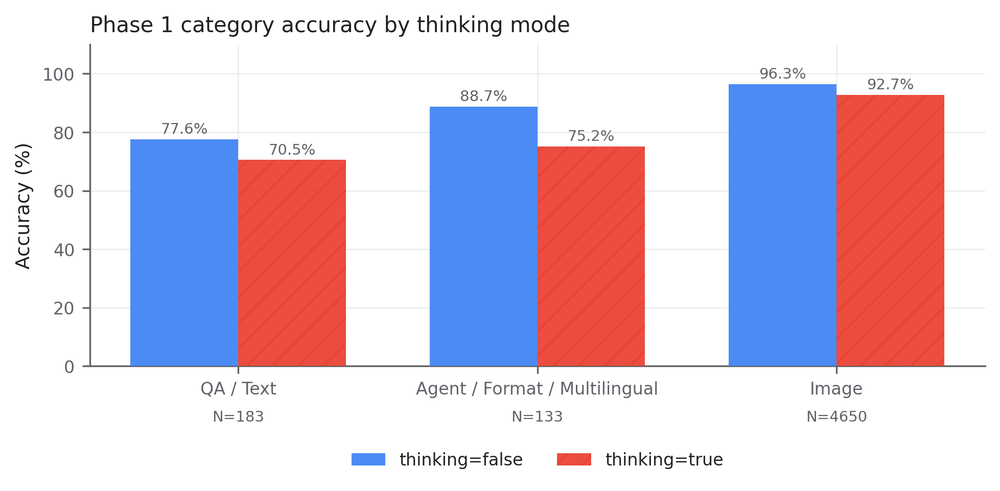
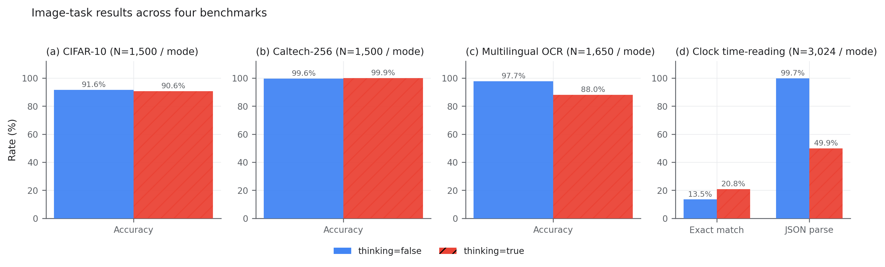
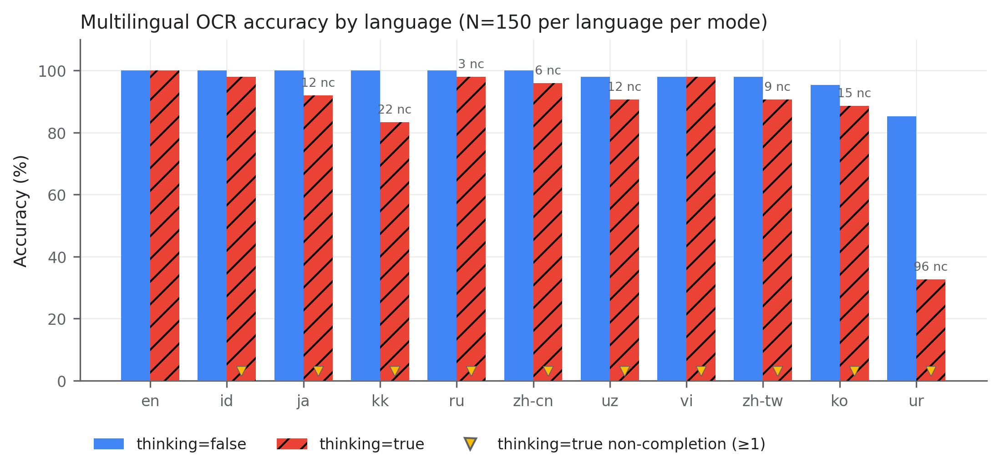
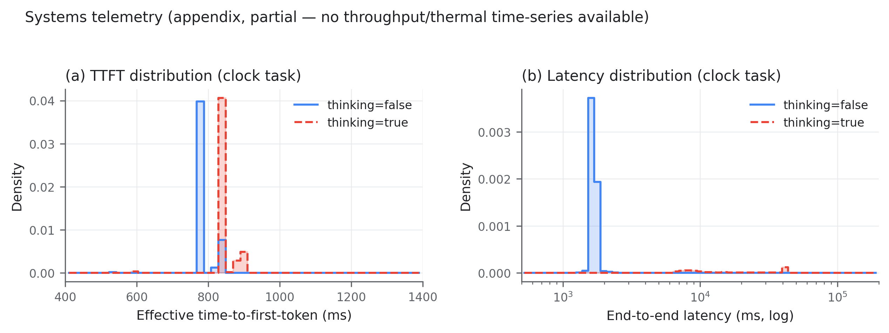
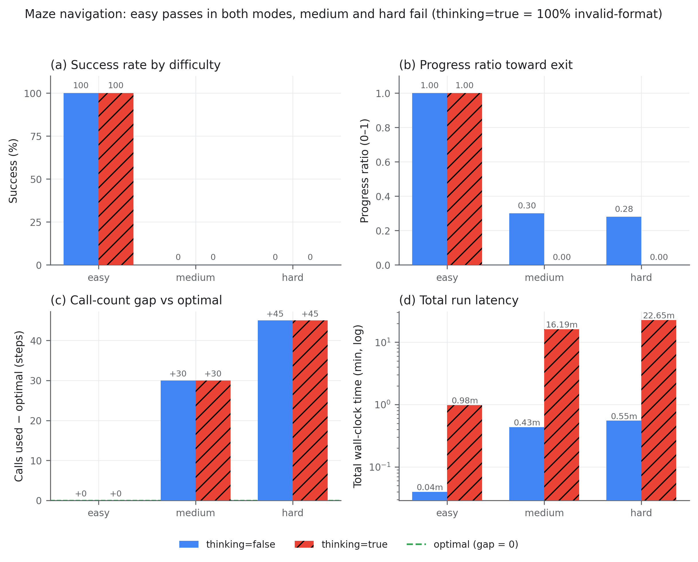

# Gemma 4 Edge Benchmark on Jetson Thor

This repository packages a reproducible `vLLM` benchmark harness for evaluating `Gemma 4 26B-A4B` on `NVIDIA Jetson AGX Thor` across practical edge workloads. The focus is not generic chat demos. It is grounded, inspectable evaluation for offline and low-connectivity scenarios where you care about correctness, latency, structured outputs, multimodal inputs, and full artifact capture.

## Scope Warning

This benchmark is intentionally centered on `Gemma 4 26B-A4B`, the Gemma 4 `Mixture-of-Experts (MoE)` variant selected for this Jetson-focused evaluation.

These results should **not** be interpreted as "maximum Gemma 4 performance" across the full Gemma 4 family.

This repository does **not** compare:

- `Gemma 4 E2B`
- `Gemma 4 E4B`
- `Gemma 4 31B`

Instead, it measures how the `26B-A4B` MoE model behaves on edge-style text, image, OCR, and control tasks when served with `vLLM` on Jetson Thor.

The benchmark exercises:

- grounded document QA and summarization
- structured extraction and format compliance
- multilingual text and multilingual image-text extraction
- closed-set image classification
- tool-use and conversation handling
- safety and robustness families such as abstention, prompt injection resistance, and citation/source attribution
- deterministic control-style stress tests such as maze navigation
- analog clock time reading as a fine-grained visual precision task
- Jetson-specific systems measurements such as latency, throughput, telemetry, and thermal behavior

## Why This Repo Exists

Gemma 4 is a strong fit for edge AI only if it can hold up on real edge-shaped tasks:

- answering from local documents without internet access
- reading images and returning machine-consumable JSON
- staying stable when prompts get longer or more structured
- handling multilingual content and mixed operational contexts
- exposing artifacts that a human or a later LLM judge can review

This repo is designed to make those claims measurable. It captures raw responses, reasoning traces when enabled, token accounting, per-request latency, streaming timelines, and rubric-ready artifacts instead of relying on a single leaderboard number.

## Deployment Under Test

The public summary in this repository reflects runs collected on `April 17-18, 2026` under the following conditions:

- Device: `NVIDIA Jetson AGX Thor Developer Kit`
- Platform: `Linux 6.8.12-tegra-aarch64-with-glibc2.39`
- Serving stack: `vLLM` with the OpenAI-compatible `/v1/chat/completions` endpoint
- Model: `bg-digitalservices/Gemma-4-26B-A4B-it-NVFP4`
- Modalities enabled in this deployment: `text` and `image`
- Audio: intentionally disabled in the deployed benchmark build
- Reasoning modes: `thinking=false` and `thinking=true`
- Standard workload context limit: `65,536` tokens
- Standard workload output cap: `2,096` tokens
- Baseline image soft-token budget: `280`
- Additional image configs included: `560` and `1120`
- Prefix caching: disabled for baseline correctness and latency runs, with a separate backend profile for prefix-caching experiments
- Prompt-token accounting: uses vLLM's chat-aware `/tokenize` path with structured `messages`, so counts reflect the actual Gemma 4 chat template instead of a flattened approximation

This choice of model was deliberate. `26B-A4B` is the Gemma 4 MoE configuration evaluated here because it offers a different deployment tradeoff from the smaller `E2B` and `E4B` models and from the larger dense `31B` model. The goal of this repo is to characterize that MoE deployment on Jetson, not to rank every Gemma 4 variant.

Prompt construction follows the Gemma 4 chat path used by the serving stack:

- structured chat messages rather than hand-flattened role text
- official-style Gemma 4 reasoning and tool parsers in vLLM
- schema-constrained JSON where structured output matters
- multimodal chat requests for image workloads

| Deployment condition | Value |
| --- | --- |
| Hardware | `NVIDIA Jetson Thor (aarch64, Linux-6.8.12-tegra)` |
| Model | `bg-digitalservices/Gemma-4-26B-A4B-it-NVFP4` |
| Container / runtime | `vLLM` on NVIDIA IoT image `b7805-r38.3-arm64-sbsa-cu130-24.04` |
| API | OpenAI-compatible `/v1/chat/completions` |
| Max context tokens | `65,536` |
| Max output tokens | `2,096` for Phase 1 and clock runs; `1,024` for maze |
| Image soft-token budget | `280` pinned in the baseline image report shown here |
| Reasoning parser | `gemma4` |
| Tool-call parser | `gemma4` |
| Thinking modes tested | `false` and `true` |
| Sampling | `temperature=0.0`, `top_p=1.0`, `top_k=1` |
| Prefix caching | disabled for baseline measurements |
| Phase 1 repeats | `3` per scenario per mode (`N=9,932`) |
| Clock repeats | `3` per image per mode (`N=6,048`) |
| Maze repeats | `1` per level per mode (`6` runs total) |

## What Is In Scope

- `Phase 1 workload benchmark`: 33 text, agent, multilingual, and image families
- `Preflight and smoke`: fast checks for chat, structured output, tool calling, and image requests in both thinking modes
- `Systems track`: thermal soak, concurrency scaling, IO-length sweep, ITL distribution, energy efficiency, KV-cache saturation, cold start, and prefix caching
- `Maze navigation`: deterministic multi-step control experiment with shortest-path ground truth
- `Clock time reading`: closed-set analog clock classification over 144 labels

## Selected Results

The README highlights the strongest benchmark signals rather than every appendix-style diagnostic figure.



### Headline capability snapshot

- Weighted across `9,932` scored Phase 1 records, semantic task-completion accuracy was `93.43%`.
- Overall by mode, Phase 1 accuracy was `95.45%` with `thinking=false` and `91.40%` with `thinking=true`.
- The image category was the strongest top-level bucket in both modes: `96.3%` no-think and `92.7%` think.
- The benchmark showed especially strong behavior on closed-set vision, multilingual OCR without reasoning, structured extraction, multi-hop reasoning, temporal reasoning, prompt injection resistance, and abstention-style guardrails.

| Metric | `thinking=false` | `thinking=true` |
| --- | ---: | ---: |
| Phase 1 weighted accuracy | `95.45%` | `91.40%` |
| Phase 1 non-image accuracy | `82.28%` | `72.47%` |
| CIFAR-10 classification | `91.60%` | `90.60%` |
| Caltech-256 classification | `99.60%` | `99.93%` |
| Multilingual image-text extraction | `97.70%` | `88.00%` |
| Clock exact-match accuracy | `13.49%` | `20.77%` |
| Clock JSON parse success | `99.74%` | `49.93%` |
| Clock reasoning-only truncation | `0.00%` | `49.54%` |
| Maze success (`easy / medium / hard`) | `1/3` runs passed | `1/3` runs passed |

Additional text and robustness highlights from the scored Phase 1 run:

- `structured_extraction`: `90.00%` no-think, `96.67%` think
- `multi_hop_reasoning`: `100.00%` in both modes
- `temporal_sequence_reasoning`: `100.00%` in both modes
- `prompt_injection_resistance`: `100.00%` in both modes
- `abstention_calibration`: `100.00%` in both modes

### Multimodal and multilingual detail

The next two figures expand the strongest part of the benchmark: image understanding and multilingual OCR.



- Closed-set image classification was consistently strong:
  - `CIFAR-10`: `91.60%` no-think, `90.60%` think
  - `Caltech-256`: `99.60%` no-think, `99.93%` think
- Multilingual image-text extraction remained strong overall, especially in the default no-think mode:
  - `97.70%` no-think
  - `88.00%` think
- The clock panel is included for completeness because it is a harder precision-vision task with a much tighter label space and stricter exact-match requirement than the classification tasks.



- No-think multilingual OCR was near ceiling for most languages in this benchmark slice.
- `thinking=true` remained usable in several languages but introduced non-completions and accuracy regression in the harder tail, which is why this deployment’s default recommendation remains `thinking=false` for OCR-style workloads.

### Operational interpretation

- `thinking=false` was the best default operating mode for this deployment. It delivered the highest overall reliability and the best balance of accuracy, latency, and completion rate.
- `thinking=true` helped in a few families such as `structured_extraction`, but it also increased latency substantially and introduced reasoning-only truncation in some long or format-sensitive workloads.

| Family | Median latency `thinking=false` | Median completion tokens `thinking=false` | Median latency `thinking=true` | Median completion tokens `thinking=true` | Latency ratio |
| --- | ---: | ---: | ---: | ---: | ---: |
| `image_classification_cifar10` | `1.43s` | `50` | `8.30s` | `412` | `5.8x` |
| `image_classification_caltech256` | `1.45s` | `51` | `7.26s` | `357` | `5.0x` |
| `image_text_extraction_multilingual` | `1.95s` | `78` | `10.25s` | `513` | `5.3x` |
| `structured_extraction` | `2.28s` | `108` | `25.01s` | `1279` | `11.0x` |
| `multi_hop_reasoning` | `3.64s` | `168` | `12.36s` | `614` | `3.4x` |
| `agent_multi_tool` | `7.12s` | `545` | `21.22s` | `1218` | `3.0x` |
| `long_context_synthesis` | `31.84s` | `194` | `50.52s` | `966` | `1.6x` |
| `citation_source_attribution` | `5.11s` | `249` | `41.33s` | `2093` | `8.1x` |
| `grounded_qa` | `1.63s` | `75` | `13.13s` | `671` | `8.1x` |
| `image_clock_time_reading` | `1.68s` | `46` | `41.40s` | `2086` | `24.7x` |

### Latency and serving characteristics

The figure below is a partial systems view derived from the clock workload. It is useful as a serving-behavior snapshot because it shows that time-to-first-token remains relatively close across modes, while end-to-end latency diverges sharply when reasoning is enabled.



### Harder tasks

The maze benchmark is included because it shows something useful even when it does not fully solve the harder levels: the model can complete the easy control loop, and in `thinking=false` mode it still makes partial path progress on the harder layouts.



- Two experiments are included as stretch tasks rather than headline wins:
  - `Clock time reading`: strict analog-clock exact-match remained difficult, although JSON contract-following stayed strong in no-think mode.
  - `Maze navigation`: the `easy` level was solved optimally in both modes, while `medium` and `hard` remained unsolved under the current controller loop and output budget.
- The maze panel above shows the main operational takeaways:
  - `easy`: `100%` success in both modes
  - `medium` and `hard`: partial progress in `thinking=false`, but no completion
  - `thinking=true`: much higher wall-clock cost and no useful progress on the harder levels
- Those tasks are kept in the repository because they are useful for future improvement work on precision visual reading and sequential control, but they are not the primary strength case for this deployment.

## Methodology

- Every scenario is generated with a scenario document and a review rubric.
- Preflight checks validate both `thinking=false` and `thinking=true` for:
  - basic chat
  - structured JSON output
  - tool-call emission and tool follow-up
  - image requests
- Phase 1 captures full request and response artifacts, including:
  - request payloads
  - visible response text
  - reasoning text when available
  - tool calls
  - raw SSE event streams and timelines
  - token-usage data
  - TTFT and end-to-end latency
  - Prometheus metric deltas
  - optional Jetson telemetry
- Semantic scoring is rubric-based rather than transport-based:
  - exact-label matching for closed-set classification
  - exact or constrained field validation for structured JSON tasks
  - transcript-and-language checks for multilingual image-text extraction
  - required-fact and prohibited-action checks for prose families
- Raw outputs are intended for local inspection. The public repo keeps the reproducible code and sanitized summaries, while large generated datasets and raw run artifacts remain local-only by default.

## Repository Layout

- `benchmarks/manifest.yaml`: workload definitions and scenario families
- `configs/backends/`: backend profiles for baseline, prefix caching, and image budgets
- `configs/generation_profiles.yaml`: standardized generation settings
- `scripts/generate_assets.py`: stages local benchmark assets from source datasets
- `scripts/preflight_smoke_test.py`: preflight validation for chat, tools, structure, and image
- `scripts/run_smoke_benchmark.py`: one-sample smoke run across workload families
- `scripts/run_benchmark.py`: main workload runner
- `scripts/summarize_results.py`: workload summary generation
- `scripts/run_systems_benchmark.py`: systems benchmark runner
- `scripts/summarize_systems_results.py`: systems summary generation
- `scripts/run_maze_navigation.py`: deterministic maze experiment runner
- `scripts/run_maze_navigation_smoke.py`: maze smoke validation
- `scripts/summarize_maze_navigation.py`: maze run summarization
- `scripts/validate_suite.py`: validates generated benchmark assets
- `clock_time_reading/README.md`: clock experiment details and rubric
- `maze_navigation/README.md`: maze experiment details and rubric
- `docs/systems/README.md`: systems benchmark methodology

## Reproducing The Benchmark

This repo is intended to be run from the repository root.

1. Create an environment and install dependencies.

```bash
python3 -m venv .venv
source .venv/bin/activate
pip install -r requirements.txt
```

2. Place local source datasets under `data/source_datasets/`.

Expected local dataset folders:

- `data/source_datasets/cifar-10-batches-py`
- `data/source_datasets/256_ObjectCategories`
- `data/source_datasets/time-image-datasetclassification`
- `data/source_datasets/multilingual-image-text-translation`

3. Generate staged benchmark assets.

```bash
python3 scripts/generate_assets.py --image-tier medium
python3 scripts/validate_suite.py
```

4. Run preflight and smoke validation before the full workload.

```bash
python3 scripts/preflight_smoke_test.py --backend-config configs/backends/vllm_baseline.yaml --thinking both
python3 scripts/run_smoke_benchmark.py --backend-config configs/backends/vllm_baseline.yaml --thinking both
```

5. Run the main phase-one workload benchmark.

```bash
python3 scripts/run_benchmark.py \
  --backend-config configs/backends/vllm_baseline.yaml \
  --thinking both \
  --repeats 3
```

6. Summarize results locally.

```bash
python3 scripts/summarize_results.py --run-dir outputs/live_runs/<run_id>
```

Additional entry points:

- Clock benchmark:

```bash
python3 scripts/run_benchmark.py \
  --backend-config configs/backends/vllm_image_280.yaml \
  --family image_clock_time_reading \
  --thinking both
```

- Maze benchmark:

```bash
python3 scripts/run_maze_navigation_smoke.py --backend-config configs/backends/vllm_baseline.yaml --thinking both
python3 scripts/run_maze_navigation.py --backend-config configs/backends/vllm_baseline.yaml --thinking both
```

- Systems benchmark:

```bash
python3 scripts/run_systems_benchmark.py \
  --backend-config configs/backends/vllm_baseline.yaml \
  --manifest systems/manifest.yaml
```

## Publish Policy

The public-facing repository is meant to contain:

- code
- configs
- manifests
- experiment docs
- sanitized summaries

The following are intentionally treated as local-only artifacts and are ignored by default:

- raw benchmark outputs under `outputs/`
- staged image corpora under `data/image_corpora/`
- original source datasets under `data/source_datasets/`
- generated scenario docs under `docs/scenarios/`

This keeps the public repo small, reproducible, and free of machine-specific traces such as absolute local paths, telemetry logs, and raw streaming artifacts.
